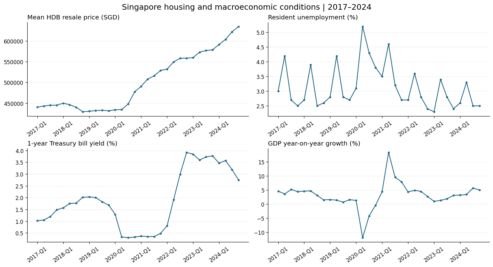
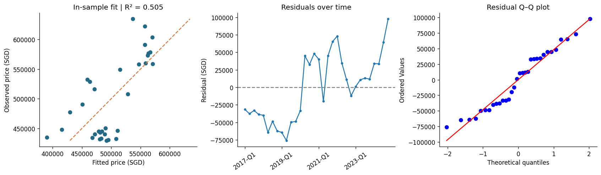

# Singapore HDB Resale & Macroeconomic Analysis

**How does unemployment relate to Singapore's resale housing market?** An exploratory analysis of 32 quarters of HDB prices, resident unemployment, Treasury bill yields, and GDP growth from 2017 to 2024.

**Python · pandas · NumPy · SciPy · SQLite · Matplotlib**

[Explore the notebook](analysis.ipynb) · [Open in Colab](https://colab.research.google.com/github/ZEDWHYYY/hdb-resale-macro-analysis/blob/main/analysis.ipynb) · [Data sources](data/README.md)



## What this project demonstrates

- Preparing and integrating four public datasets through quarterly aggregation, wide-to-long reshaping, and SQL joins.
- Investigating seasonality and changes in correlations across pre-pandemic, pandemic, and post-pandemic periods.
- Implementing multiple OLS regression, residual diagnostics, variance inflation factors, and a Mann–Whitney U comparison.
- Checking numerical results against written conclusions and communicating the limits of observational analysis.

## Findings

| Analysis | Reproduced result | Interpretation |
|---|---|---|
| Raw unemployment–price correlation | r = −0.328; p = 0.067 | Not significant at the conventional 5% threshold |
| After simple seasonal adjustment | r = −0.456; p = 0.009 | Stronger within-sample association; time-series caveats apply |
| Multiple regression | R² = 0.505; adjusted R² = 0.452 | In-sample fit, not forecasting accuracy |
| Unemployment coefficient after controls | +SGD 10,756 per percentage point; p = 0.476 | Does not support the hypothesized negative association |
| High/low unemployment price comparison | U = 97; p = 0.279 | No significant distribution difference in this test |

These are **associations, not causal effects**. The sample contains only 32 time-ordered observations. Shared trends, autocorrelation, changing flat composition, and omitted policy variables limit interpretation. Conventional test p-values do not account for all these issues. No out-of-sample forecasting claim is made.

All results above come from a complete execution of the included data snapshot.

## Run locally

Python 3.11+ recommended; verified with Python 3.13.

```bash
git clone https://github.com/ZEDWHYYY/hdb-resale-macro-analysis.git
cd hdb-resale-macro-analysis
python -m venv .venv
source .venv/bin/activate  # Windows: .venv\Scripts\activate
pip install -r requirements.txt
jupyter lab analysis.ipynb
```

Run all cells from the repository root. The included data snapshot makes the analysis runnable without private files, API credentials, or Google Drive access. In Colab, first clone this repository and change into its directory in a new setup cell:

```python
!git clone https://github.com/ZEDWHYYY/hdb-resale-macro-analysis.git
%cd hdb-resale-macro-analysis
```

To refresh from raw government exports, follow [the data instructions](data/README.md), then run `python src/prepare_data.py`. The four-source preparation pipeline writes SQLite tables and the integrated CSV. A fresh export may include source revisions, so review results after rerunning.

## Repository guide

| File | Purpose |
|---|---|
| `analysis.ipynb` | Executed analysis with plots and interpretation |
| `src/prepare_data.py` | Raw-data cleaning, validation, and SQLite integration |
| `data/quarterly_2017_2024.csv` | Complete 32-quarter analysis snapshot |
| `data/README.md` | Definitions, provenance, official sources, and rebuild instructions |
| `reports/` | Generated figures and machine-readable results |



## Future work

Use a mix-adjusted price measure, test stationarity and first differences, add trends and lagged variables, estimate autocorrelation-robust uncertainty, and assess forecasts using time-ordered holdouts.
